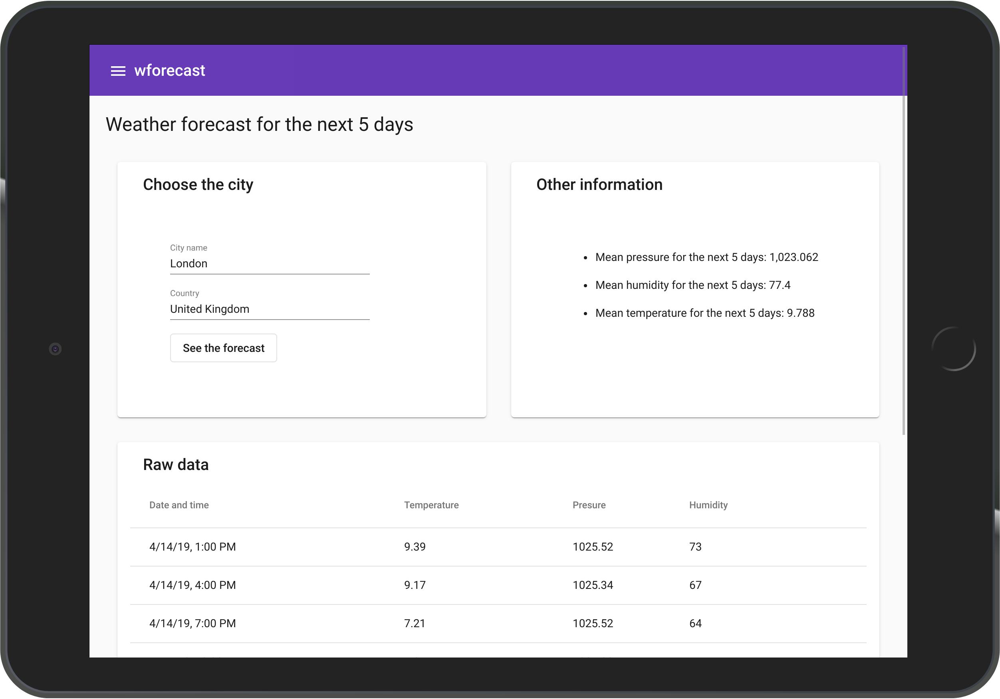

# Wforecast

5-day weather forecast app based on information acquired from openweathermap.org

Done as an excerise.



Sidenote: This app uses openweathermap token that will soon expire, if you want to use it, edit apiKey in app/core/services/weather.service.

Another note: App is optimized for larger screens but can be adapted for phones very easily.

## Development
These instructions will get you a copy of the project up and running on your local machine for development and testing purposes.

### Prerequisites
Download the source code or clone the repo. You also need either docker and docker-compose or node 10 and npm.

### With docker
Just run
```
docker-compose up
```

### Locally
```
npm install
npm start
```

Navigate to `http://localhost:4200/`.

## Running tests

### Running unit tests

Run `ng test` to execute the unit tests via [Karma](https://karma-runner.github.io).

### Running end-to-end tests

Run `ng e2e` to execute the end-to-end tests via [Protractor](http://www.protractortest.org/).

## Built With

* [Angular](https://www.angular.io/) - The web framework used
* [Angular Material](https://material.angular.io/) - Component library
* [TypeScript](https://www.typescriptlang.org/) - Superset of JavaScript with typing

## Authors

* **Karol Horosin** - *Initial work* - [horosin](https://github.com/horosin)

## License

This project is licensed under the MIT License.

## Acknowledgments
- Thanks to openweathermap for sharing the data.
